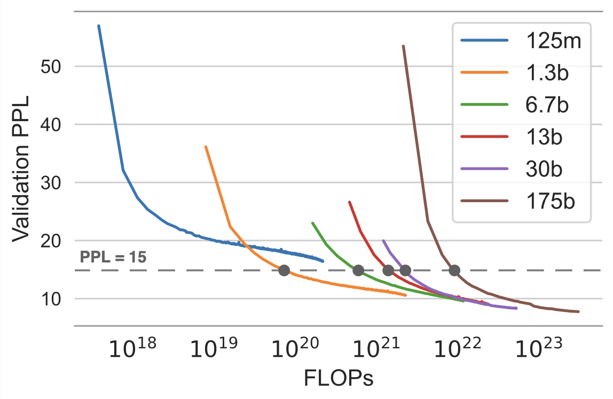
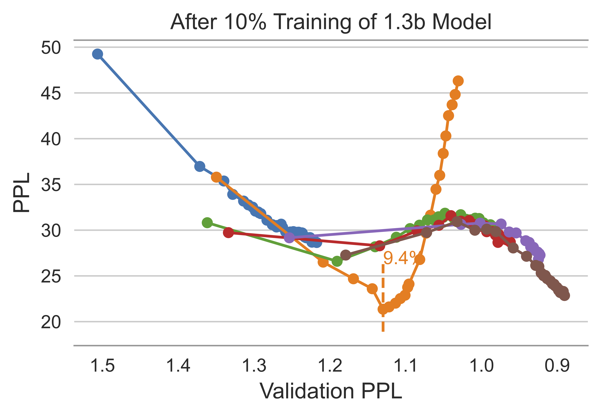
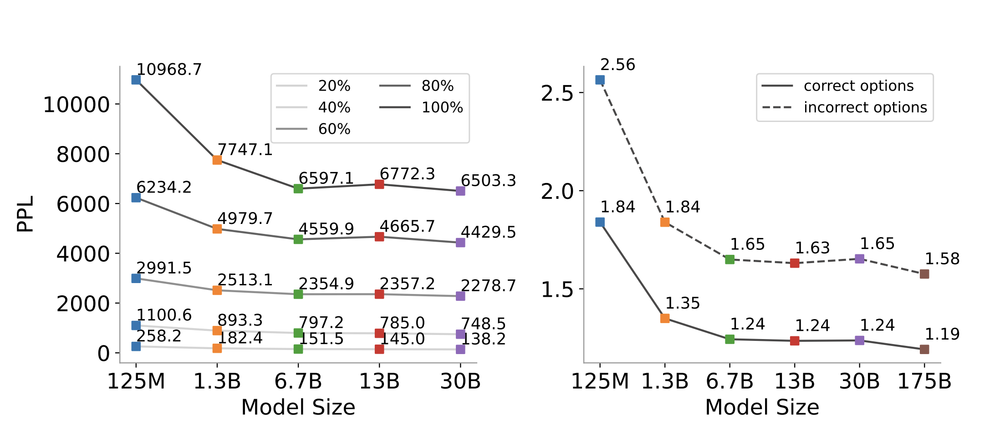
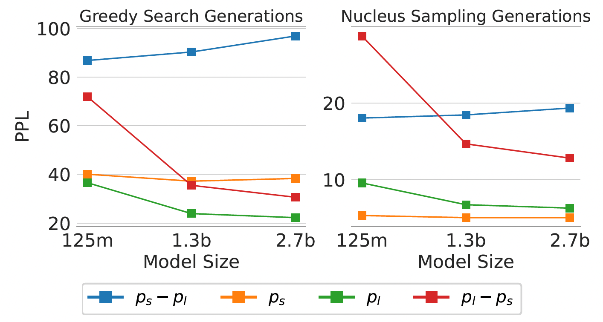
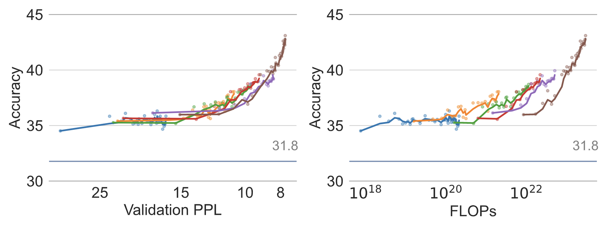
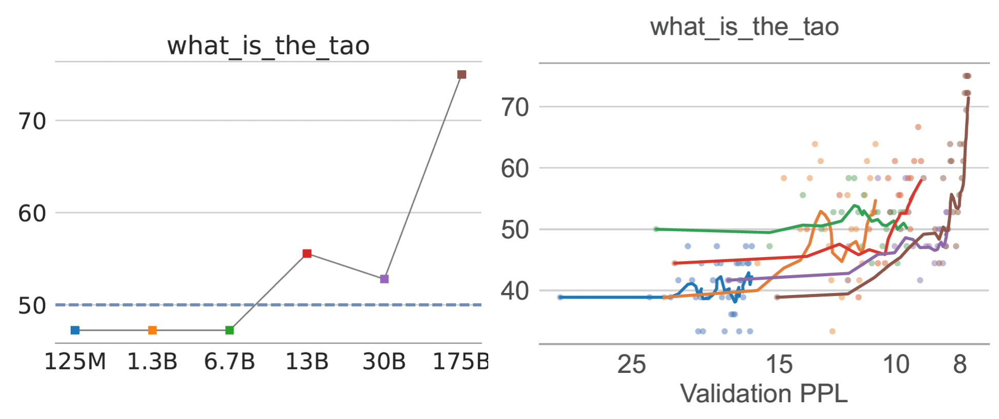

## 📈 Training Trajectories of Language Models Across Scales

This repository contains the code and analysis results for our ACL'23 paper [Training Trajectories of Language Models Across Scales](https://arxiv.org/pdf/2212.09803.pdf). We consider the examination of language model (LM) trajectories as a crucial and impactful approach for comprehending the behavior of LMs and encourage researchers to try out approaches on open-sourced checkpoints like [Pythia](https://github.com/EleutherAI/pythia).

**************************** **Updates** ****************************
* 05/25/2022: Our paper gets accepted to ACL 2023! We update the camera ready version on ArXiv and release the code base.
* 12/19/2022: We released [our paper](https://arxiv.org/pdf/2212.09803.pdf). Check it out!

## 🔗 Quick Links

- [📈 Training Trajectories of Language Models Across Scales](#-training-trajectories-of-language-models-across-scales)
- [🔗 Quick Links](#-quick-links)
- [🔍 Overview](#-overview)
- [📊 Analysis](#-analysis)
  - [📥 Preparation](#-preparation)
  - [1️⃣ Token-level analysis](#1️⃣-token-level-analysis)
  - [2️⃣ Sequence-level analysis for generated sequences](#2️⃣-sequence-level-analysis-for-generated-sequences)
  - [3️⃣ Downstream tasks](#3️⃣-downstream-tasks)
- [❓ Bugs or Questions?](#-bugs-or-questions)
- [📕 Citation](#-citation)

## 🔍 Overview

The objective of this study is to analyze the **training trajectories of language models**, from a size of 125M to 175B parameters. The study focuses on examining the trends of token-level perplexity, sequence-level perplexity of generated sequences, and downstream task performance. Our findings reveal that models of various scales, when pre-trained with identical data in the same sequence, exhibit similar behaviors and demonstrate comparable patterns as training progresses. This similarity in behavior is observed not at the same number of floating-point operations (FLOPs) or the same quantity of tokens processed, but rather **at the same level of perplexity**.

To illustrate this, the validation curves presented below depict five checkpoints (gray points) corresponding to different model sizes at a validation perplexity of 15. Despite their varying sizes, these checkpoints **exhibit similar perplexity levels and yield comparable predictions**.



## 📊 Analysis
Each part's analysis code is released in a separate notebook. Please note that the code for performing inference with model checkpoints, either for language modeling or downstream tasks, is not included in this repository. We solely provide code for the analysis conducted once all results have been gathered. 

### 📥 Preparation 
> git clone https://github.com/xiamengzhou/training_trajectory_analysis.git  
> % Please download the our analysis results via [this link](https://drive.google.com/file/d/1ivlsydPqgMpm1t1hHiNAPEPCLYBvo7ZF/view?usp=sharing).  
> unzip data.zip   
> mv data training_trajectory_analysis

### 1️⃣ Token-level analysis
This analysis consists of three parts:

1) The first part involves collecting token-level perplexity of model checkpoints on a document and saving it in the following format: {model_size: np.array(num_tokens, num_checkpoints)}. An example can be found in `data/all_ppls-gutenberg_pg-19.pt`.
2) The second part focuses on analyzing the trend of each token in intermediate checkpoints using the function `collect_trend_of_tokens` in `utils.py`.
3) The third part includes calculating the percentage of tokens exhibiting different trends (stagnated, upward trend, and downward trend). Additionally, it involves plotting the perplexity of tokens for each trend against FLOPs and validation perplexity. This analysis is presented in `analysis_section1.ipynb`.

**Selected analysis -- Double descent**: During the course of training, it was discovered that approximately **9.4%** of the tokens exhibited **a double-descent trend** in perplexity, as shown in the graph below.



### 2️⃣ Sequence-level analysis for generated sequences
The analysis comprises three main components:

1) In the first part, sequences are decoded by taking a weighted sum of predicted probabilities for the next token from two models of varying sizes. This functionality can be found in the utils.py file under the decode function.
2) The second part involves calculating the trajectories of the generated sequences and structuring the results in the format specified in data/generation_analysis/final_model_results.csv.
3) Finally, the perplexity of the generated sequences is plotted using the analysis_section2.ipynb notebook.

**Selected analysis -- Joint decoding**: We show that by subtracting the small model's probabilities from the large model's probabilities, greedy decoding could achieve similar generation quality as neucleus sampling.


> Greedy decoding with $p_l - p_s$: </s>*The weather is nice today. Let's* go to the park and play some games!</s>  
> Nucleus sampling with $p_l - p_s$: </s>*The weather is nice today. Let's* go to the park for some sun and picture taking!</s> 

**Selected analysis -- Noisy data shows a regular scaling trend**: We show that for inputs injected with noise and factually incorrect sequences, the perplexity still decreases as model size increases.



**Selected analysis -- Sequences that follow an inverse scaling trend**: We found sequences that follow an inverse scaling trend ($p_s - p_l$) as the model size increases by maximizing the probablity of the small model and minimizing the probability of the large model. The following graph shows that such a inverse scaling trend holds across model families, where the sequences are generated with OPT models and are evaluated on the GPT-Neo models. 



### 3️⃣ Downstream tasks
This analysis consists of three parts:
1) In the first part, we run the language models on downstream tasks with task-specific instructions and we collect task accuracy and perplexity of the prompt (with different options).
2) We plot the following graphs in `analysis_section3.ipynb`
   1) average accuracy against validation perplexity and FLOPs
   2) option perplexity against valdation perplexity
   3) trajectory of linearity and breakthroughness tasks
  
**Selected analysis -- Downstream performance align with validation perplexity**: Such a trend is model agostic. Two models at the same perplexity level achieve similar downstream task performances, regardless of model sizes. 



**Selected analysis -- Emergence occurs smoothly on trajectory**: Our investigation reveals that tasks demonstrating an emergent performance boost, commonly known as breakthroughness tasks, exhibit a smooth learning progression along the trajectory. This finding aligns with what is found in [Schaeffer et al., 2023](https://arxiv.org/abs/2304.15004), where they observe that transitioning from non-linear or discontinuous metrics, such as model sizes, to linear or continuous metrics like perplexity, results in smooth and continuous changes. In our study, we have observed a similar pattern when altering the granularity of evaluation points from models of different sizes to intermediate checkpoints.



## ❓ Bugs or Questions?
If you have any questions related to the code or the paper, feel free to email Mengzhou (mengzhou@princeton.edu). If you encounter any problems when using the code, or want to report a bug, you can open an issue. Please try to specify the problem with details so we can help you better and quicker!

## 📕 Citation
Please cite our paper if you find our analysis helpful in your work:

```bibtex
@inproceedings{xia2023training,
   title={Training Trajectories of Language Models Across Scales},
   author={Xia, Mengzhou and Artetxe, Mikel and Zhou, Chunting and Lin, Xi Victoria and Pasunuru, Ramakanth and Chen, Danqi and Zettlemoyer, Luke and Stoyanov, Ves},
   booktitle={Association for Computational Linguistics (ACL)},
   year={2023}
}
```
